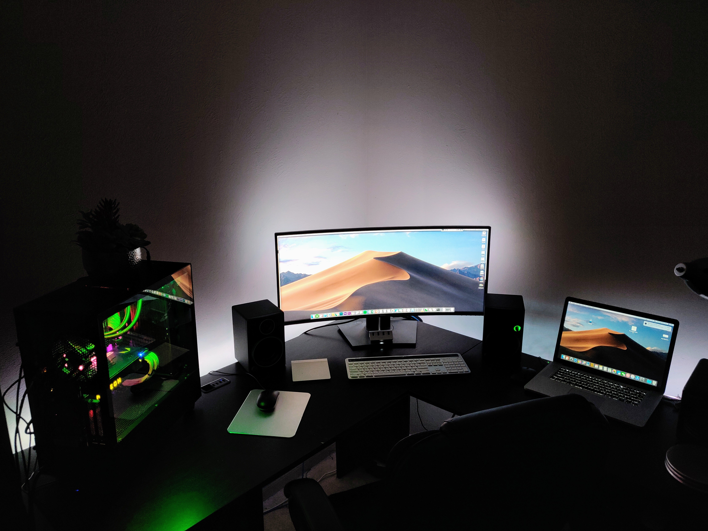
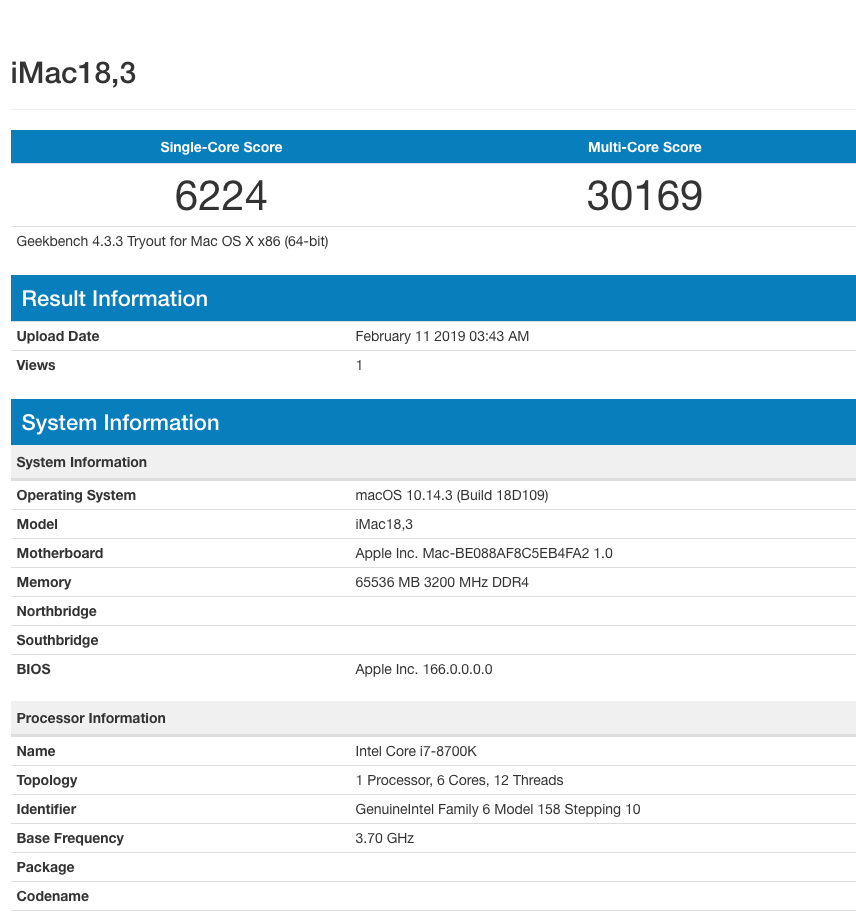
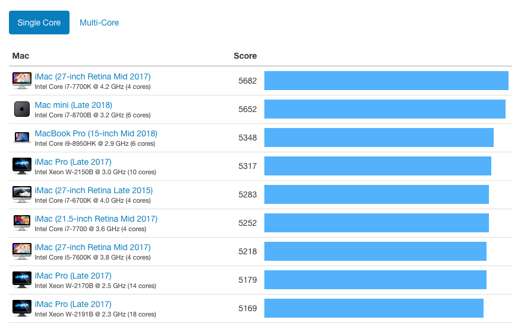
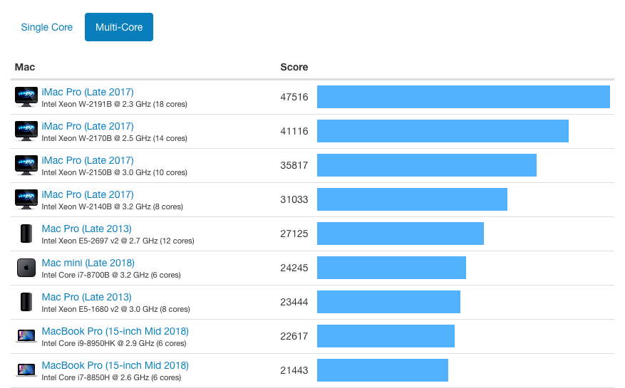
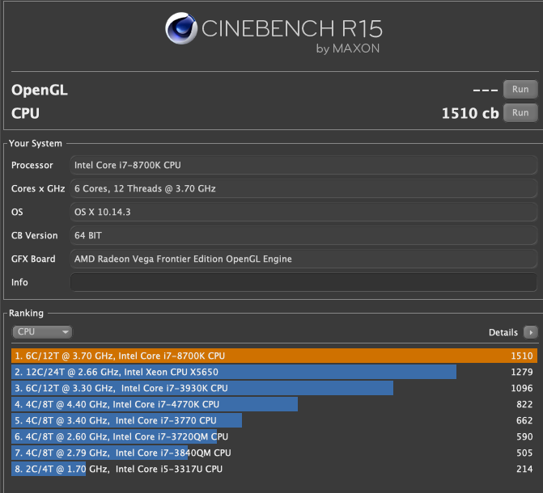

# My Benchmarks

I am going to post some of the benchmarks on my system that I recorded.

## GeekBench 4 - CPU

These GeekBench 4 CPU scores are quite excellent. However, remember that I overclocked this CPU to 4.9 GHz from its stock frequency of 3.6 GHz. With 100% load my Core CPU temperatures hover around 70 C. 

In comparison to other Macs, **Single Core** Geekbench scores are out of this world.

In fact, these numbers demonstrate that my current hackintosh outperforms even the Retina 5K iMac, which has the best Single core Geekbench CPU performance.

However, when compared to other iMac Pros that have 10, 12 and 14 cores, **Multi Core** Geekbench scores leave my hackintosh in the dust with its measely 6-cores. However, you will see that it ranks right below the base iMac model. My hackintosh cost me a total of $1800 to build, which considering everything is a fraction of the price of an iMac Pro.

## CineBench

Cinebench scores are satisfactory, scoring approximately 1500 in CPU performance.

## Blackmagic Disk Speed Test

Blackmagic Disk Speed Test really shows how powerful these new generation 970 EVO Samsung m.2 NVME PCIe drives are. 2.2-2.8 GB/s is an incredible amount of speed.

Overall, I am extremely happy with the way my system has performed.

