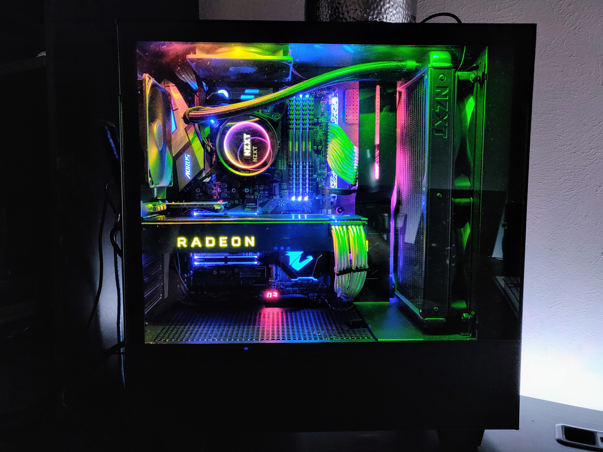

# A GUIDE TO A VANILLA HACKINTOSH FROM SCRATCH


      

This build includes:
```
Intel i7-8700k
Gigabyte Z370 Aorus Gaming 5 Motherboard
AMD RX Vega 64 Frontier Edition GPU
64 GB RAM
```

This guide was something I put together as I was trying to build a fully functional hackintosh for 4k Video editing. I am  primarilyy *Final Cut Pro X* user, and my 2013-late Macbook Pro was beginning to show its age with rendering, timeline scrubbing so I thought it was time to upgrade to an iMac Pro until I was horrified when I found the prices I would be forced to pay.

So I thought I would go the hackintosh route. I used the famous vanilla hackintosh subreddit (r/hackintosh) on Reddit to get my feet wet and over the course of two weeks read pretty much every article I could find on the subject. After a lot of searching I managed to have a good understanding of how hackintoshes (and MacOS) works with the hardware and started writing things down. After a lot of time (close to a month of tinkering) I managed to complete this project with a *fully functional* hackintosh that cuts through 4K footage like butter. 

This information did not come out of thin air. I am very grateful to the wonderful folks on Reddit's r/hackintosh subreddit as well as the good contributors at [TonyMacx86.com](https://tonymacx86.com/), and the users at [InsanelyMac.com](https://insanelymac.com/)  all of whom were tremendously helpful. At the end of it all, I wanted to publish my guide, both as a template of how to build a hackintosh and also so that it provides an all-in-one education to anyone who wants to learn the vanilla method. 

*DISCLAIMER : I will begin by saying that while I wrote this piece from start to scratch, there are segments that I directly copied (for my convenience) off other people’s work and annotated with my own thoughts. This is by no means intended to stand alone as my own work, and I have credited and linked every one of those posts when I have borrowed segments from the work of others. I only provide this as a public service.*

This guide has been divided into sections which include a tutorial on how to install MacOS on a PC as well as some educational content associated with the process. Your mileage may vary.

# Table of Contents

1. [The Basics of the Vanilla Method](00_Basics%20of%20the%20Vanilla%20Method.md)
2. My System Components
3. External Guides and Resources Used (**Includes download links**)
4. What Works and Doesn't Work in my Build
5. BIOS Settings
6. Creating a USB Installer with MacOS
7. Clover Builder and Configurator
8. Booting into MacOS for the First Time
9. Troubleshooting
10. A Walkthrough of Clover Configurator
11. Cosmetic Changes on your new Hackintosh
12. My Personal Benchmarks
13. Final Thoughts


      
